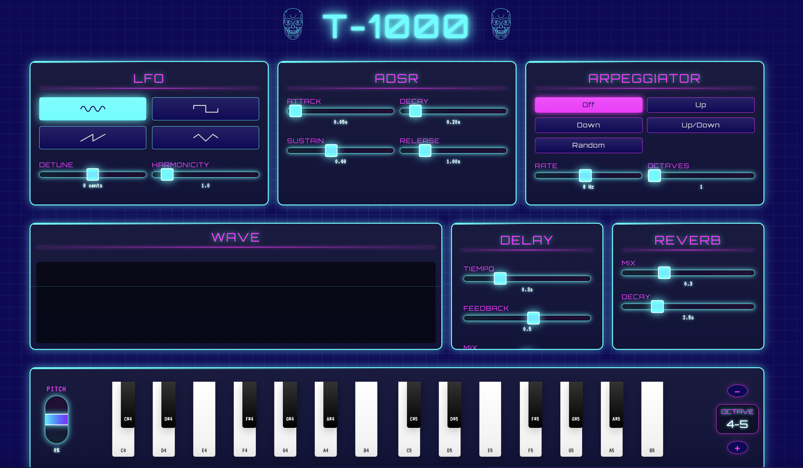

# T-1000 Synthesizer

A retro-futuristic web synthesizer with delay, reverb, and arpeggiator effects. Built with Tone.js and vanilla JavaScript.

## Features

- Interactive keyboard with physical keyboard support
- Different oscillator types (Sine, Square, Sawtooth, Triangle)
- Configurable ADSR envelope
- Built-in effects:
  - Delay with adjustable time and feedback
  - Reverb with adjustable mix and decay
- Arpeggiator with multiple modes (Up, Down, Up/Down, Random)
- Octave control
- Real-time waveform visualizer

## Technologies

- HTML5
- CSS3
- JavaScript
- [Tone.js](https://tonejs.github.io/) for audio synthesis

## Usage

1. Open `index.html` in your browser
2. Use your mouse or physical keyboard to play notes
3. Experiment with different controls and settings to create your unique sound

## Keyboard Controls

- Keys `Z` to `M`: Lower octave
- Keys `Q` to `U`: Upper octave
- Keys with sharps: `S`, `D`, `G`, `H`, `J`, `2`, `3`, `5`, `6`, `7`
- Up/down arrows: Change octave

## License

MIT
